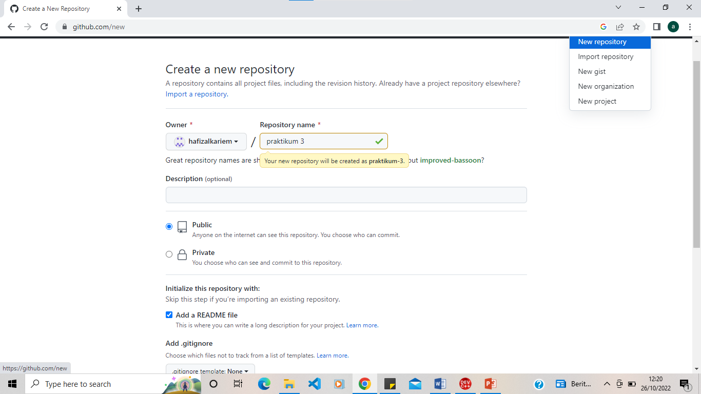

# TUTOR MENGHITUNG KELILING DAN LUAS LINGKARAN MENGGUNAKAN PYTHON
1. DOWNLOAD PYTHON

2. FLOWCHART MENGHITUNG LUAS LINGKARAN

3. FLOWCHART MENGHITUNG KELILING LINGKARAN

4. MENGHITUNG LUAS DAN KELILING LINGKARAN MENGGUNAKAN PYTHON

